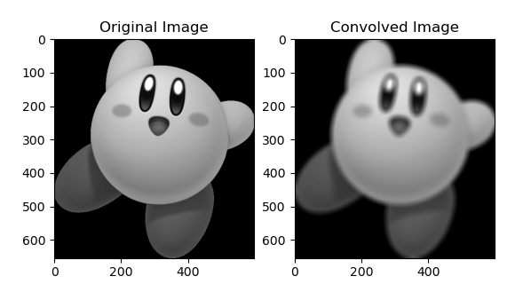

# Convo
# Image convolution with python

## Usage

1. **Clone the Repository:**
   ```bash
   git clone https://github.com/0cool-design/Convo.git
   ```
   ```bash
   cd Convo
   ```

2. **Install Dependencies:**
   ```bash
   pip install numpy scipy matplotlib pillow
   ```

3. **Run the Script:**
   ```bash
   python convo.py image.jpg 3
   ```
   - Replace `image.jpg` with the actual path to your image file.
   - `3` in the example is the kernel size.



## Dependencies

- [NumPy](https://pypi.org/project/numpy/)
- [SciPy](https://pypi.org/project/scipy/)
- [Matplotlib](https://pypi.org/project/matplotlib/)
- [Pillow](https://pypi.org/project/Pillow/)

